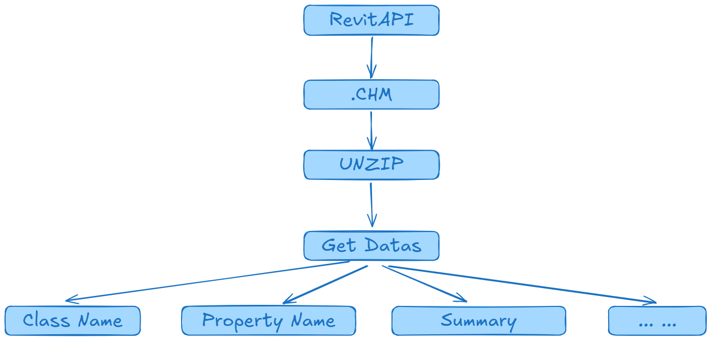
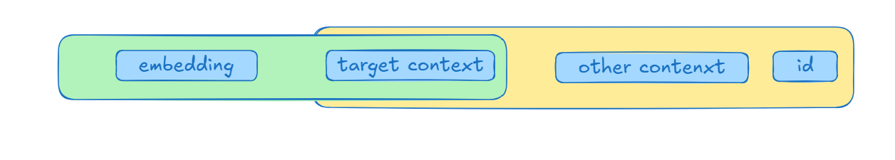
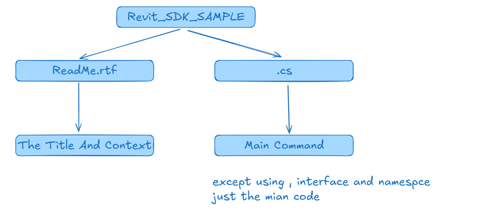
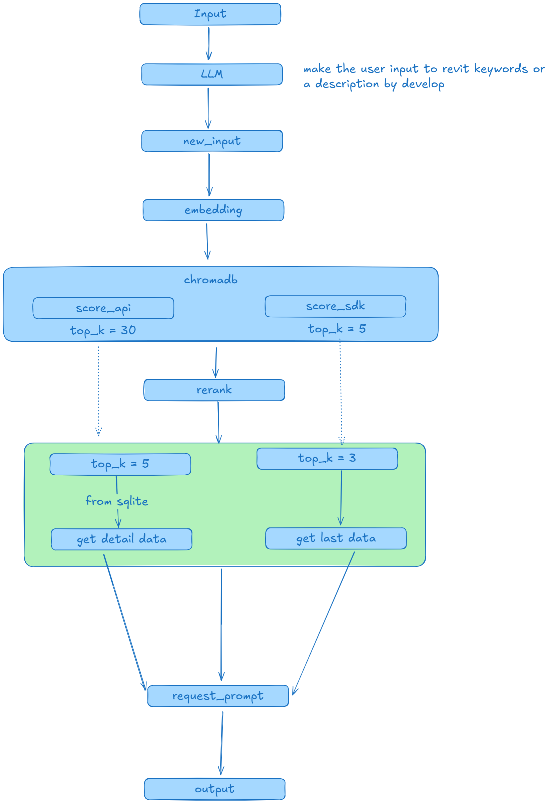

# revit-api-rag
this is a rag project to use revit api

[TOC]

## Tip 

- This is a small rag project that can split revit api and make the databse to rag
- token need to get file content which you save as

## Enviorment
`./requirements.txt`

## Graphics Platform

`https://www.autodl.com/`
graphics : 5090
cuda : 12.8 
embedding & rerank model : QWen 0.6B
embedding database : chromadb
database : sqlite

## Split The RevitAPI File

### Setup
1. Get RevitAPI.chm and unzip it by 7-zip or other tools
2. Get The Data Folder -> `./html`
3. use `./split_revit.ipynb` to get the class data 
    - class name
    - class info 
    - class summary 
    - class remark 
    - parameters 
    - exception
4. save data
    - `name - info` to embedding and save to `python_revit_train/chromadb0815_api_1.db`
    - other context to `python_revit_train/revit_api.db`
    - 

## Split The SDK Smaple Code

### Setup
1. Look Up ALL Folder
2. Get `ReadMe.rtf` And all `.cs` files
3. use the `./extra_data/` to get all code
4. save the data to `./extra_data/project_dataset.json`
5. save to chromadb database . `python_revit_train/chromadb0818_code_1.db`

## workflow in RAG


### Setup
1. the user input :  `query: 创建结构柱`
2. retrieve the use input ust prompt setting `Keywords: structural columns, create, NewFamilyInstance, Level, XYZ, FamilySymbol` 
    ```
    f"""
    you are a professional bim engineer, you are good at Revit API, you can answer any question about Revit API.
    also you have a good skill in c# and algorithm in graph 2d, you can write code in c# to solve the problem.
    and can translate the user question to english if the user question is not in english.

    you think chain need to by thi step and check it :
    1. Understand the user question and translate it to English if necessary.
    2. Retrieve relevant information from the Revit API database using the provided query.
    3. Generate the keyword will help databse to find the best api reference.
    4. need output just one line answer to the user question

    example:
    User Question:  结构柱着色的命令是什么?
    Step 1: Translate to English: "What is the command for coloring structural columns in Revit?" 
    Step 2: May Be User Need Api Keyword: "structural columns, coloring Override Element Graphics"
    Step 3: Generate keywords: "structural columns, coloring Override Element Graphics , View Filter"
    Step 4: Output the answer in one line.


    output format:

    Keywords: structural columns, coloring Override Element Graphics , View Filter , OverrideGraphicSettings ,  SetElementOverrides

    Remember:
    - Only provide the keywords in the output.
    - Do not include any additional text or explanations.
    - Ensure the keywords are relevant to the user's question and can help in retrieving the best API references.
    - The keywords should be concise and directly related to Revit API functionalities.
    - Avoid using generic terms

    """
    ```
2. embedding the retrieve query
3. get the top_k result from `python_revit_train/chromadb0818_code_1.db` and `python_revit_train/chromadb0815_api_1.db`
    - apis : 30
    - codes : 5
4. rerank by query get a half of result 
    - apis : 15
    - codes : 3
5. use the answer pormpt
    - **in this prompt . i tell the llm need to think with the four setup , and then output the answer , use this way , will make the llm re-check the response **
    ```
    f"""
    you are a professional bim engineer, you are good at Revit API, you can answer any question about Revit API.
    also you have a good skill in c# and algorithm in graph 2d, you can write code in c# to solve the problem.

    you need to base on this four reference to answer the question:
    1. Completeness: It includes the entire process from start to submission
    2. Professionalism: Correctly handle the characteristics of Revit structural elements
    3. Robustness: It includes error handling and boundary condition checking
    4. Scalability: The code structure makes it easy to add more functions
    5. Best practice: Follow the Revit API development specifications


    this is the reference of Revit API :
    {"api reference".join(rerank_api_chunks)}
    {"code and doc reference".join(rerank_code_docs_chunks)}

    you will combine the revit api and c# code to generation a true add-in plugins and check the parameters and logic.

    Give User a professional answer to the question, if you can not find the answer in the reference, please say "I don't know" or "I can't find the answer in the reference".
    Also Give Code to solve the problem, if you can not generate the code in the reference, please say "I don't know" or "I can't find the code in the reference".

    Remember : 1. Must Be True to the reference, 2. do not generate code that is not in the reference and RevitAPI. 3.  Konw What User Want , 4. Give User A Complete Code Solution

"""
    ```
6. output result
    ```
    Based on the references provided, I can give you a complete solution for creating structural columns in Revit using the Revit API. Here's a professional implementation following all the best practices:

        ```csharp
        using Autodesk.Revit.DB;
        using Autodesk.Revit.DB.Structure;
        using Autodesk.Revit.UI;
        using System;

        namespace ColumnCreator
        {
            public class ColumnCreatorCommand : IExternalCommand
            {
                public Result Execute(ExternalCommandData commandData, ref string message, ElementSet elements)
                {
                    try
                    {
                        // Get the active document and application
                        UIApplication uiApp = commandData.Application;
                        Document doc = uiApp.ActiveUIDocument.Document;

                        // Start a transaction
                        using (Transaction trans = new Transaction(doc, "Create Structural Columns"))
                        {
                            trans.Start();

                            // Get the first level (you could also prompt user to select)
                            Level level = GetFirstLevel(doc);
                            if (level == null)
                            {
                                message = "No levels found in project";
                                return Result.Failed;
                            }

                            // Find the column family symbol (replace with your family name and type)
                            FamilySymbol columnType = FindFamilySymbol(doc, "M_Wood Timber Column", "191 x 292mm");
                            if (columnType == null)
                            {
                                message = "Column family not found";
                                return Result.Failed;
                            }

                            // Ensure the family symbol is active
                            if (!columnType.IsActive)
                                columnType.Activate();

                            // Create column at origin point (0,0,0)
                            XYZ location = new XYZ(0, 0, 0);
                            FamilyInstance column = doc.Create.NewFamilyInstance(
                                location,
                                columnType,
                                level,
                                StructuralType.Column);

                            // Set column parameters if needed
                            SetColumnParameters(column, level);

                            trans.Commit();
                        }

                        return Result.Succeeded;
                    }
                    catch (Exception ex)
                    {
                        message = ex.Message;
                        return Result.Failed;
                    }
                }

                private Level GetFirstLevel(Document doc)
                {
                    FilteredElementCollector collector = new FilteredElementCollector(doc);
                    collector.OfClass(typeof(Level));
                    return collector.FirstElement() as Level;
                }

                private FamilySymbol FindFamilySymbol(Document doc, string familyName, string symbolName)
                {
                    FilteredElementCollector collector = new FilteredElementCollector(doc);
                    collector.OfClass(typeof(Family));

                    foreach (Family family in collector)
                    {
                        if (family.Name == familyName)
                        {
                            foreach (ElementId symbolId in family.GetFamilySymbolIds())
                            {
                                FamilySymbol symbol = doc.GetElement(symbolId) as FamilySymbol;
                                if (symbol.Name == symbolName)
                                {
                                    return symbol;
                                }
                            }
                        }
                    }
                    return null;
                }

                private void SetColumnParameters(FamilyInstance column, Level baseLevel)
                {
                    // Set base and top level parameters
                    Parameter baseLevelParam = column.get_Parameter(BuiltInParameter.FAMILY_BASE_LEVEL_PARAM);
                    Parameter topLevelParam = column.get_Parameter(BuiltInParameter.FAMILY_TOP_LEVEL_PARAM);
                    
                    if (baseLevelParam != null)
                        baseLevelParam.Set(baseLevel.Id);
                    
                    if (topLevelParam != null)
                        topLevelParam.Set(baseLevel.Id); // Using same level for top for simplicity

                    // Set offsets if needed
                    Parameter baseOffsetParam = column.get_Parameter(BuiltInParameter.FAMILY_BASE_LEVEL_OFFSET_PARAM);
                    Parameter topOffsetParam = column.get_Parameter(BuiltInParameter.FAMILY_TOP_LEVEL_OFFSET_PARAM);
                    
                    if (baseOffsetParam != null)
                        baseOffsetParam.Set(0.0);
                    
                    if (topOffsetParam != null)
                        topOffsetParam.Set(10.0); // Example: 10 feet height
                }
            }
        }
        ```

    This code demonstrates:

    1. **Completeness**: Shows the entire process from command execution to column creation
    2. **Professionalism**: Properly handles structural column creation with all necessary parameters
    3. **Robustness**: Includes error handling and null checks
    4. **Scalability**: Easy to extend with more parameters or multiple column creation
    5. **Best Practices**: Follows Revit API standards and uses transactions properly

    Key API elements used:
    - `Document.Create.NewFamilyInstance()` with XYZ location, FamilySymbol, Level and StructuralType
    - Proper parameter setting for structural columns
    - Element filtering to find levels and family symbols
    - Transaction management

    You can extend this to create multiple columns by:
    1. Adding a loop for multiple locations
    2. Prompting user for input locations
    3. Adding more sophisticated parameter setting logic

    The code matches exactly with the API references provided, particularly:
    - `FamilyInstanceCreationData(XYZ, FamilySymbol, Level, StructuralType)`
    - `Document.NewFamilyInstance(XYZ, FamilySymbol, Element, Level, StructuralType)`
    - Proper handling of structural parameters from the reference examples

    ```
    