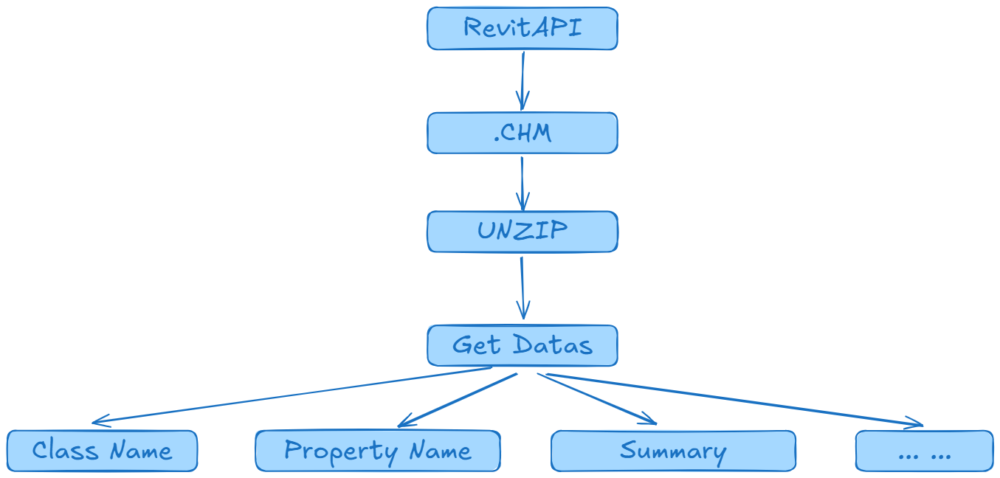
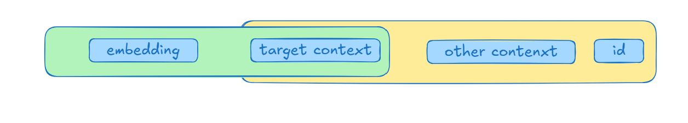
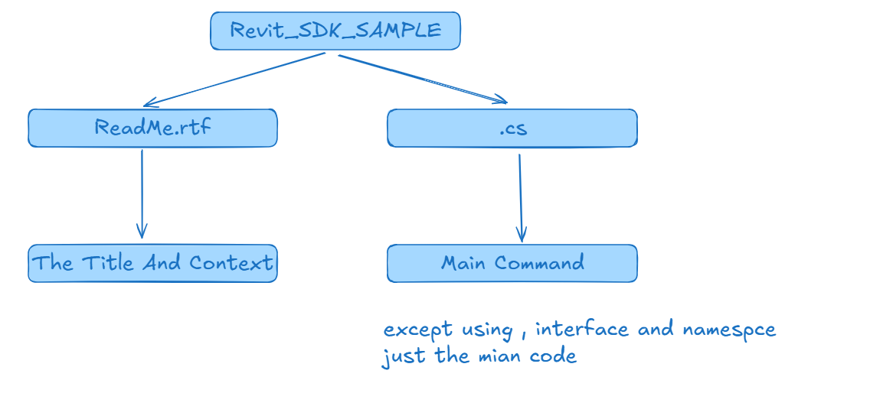
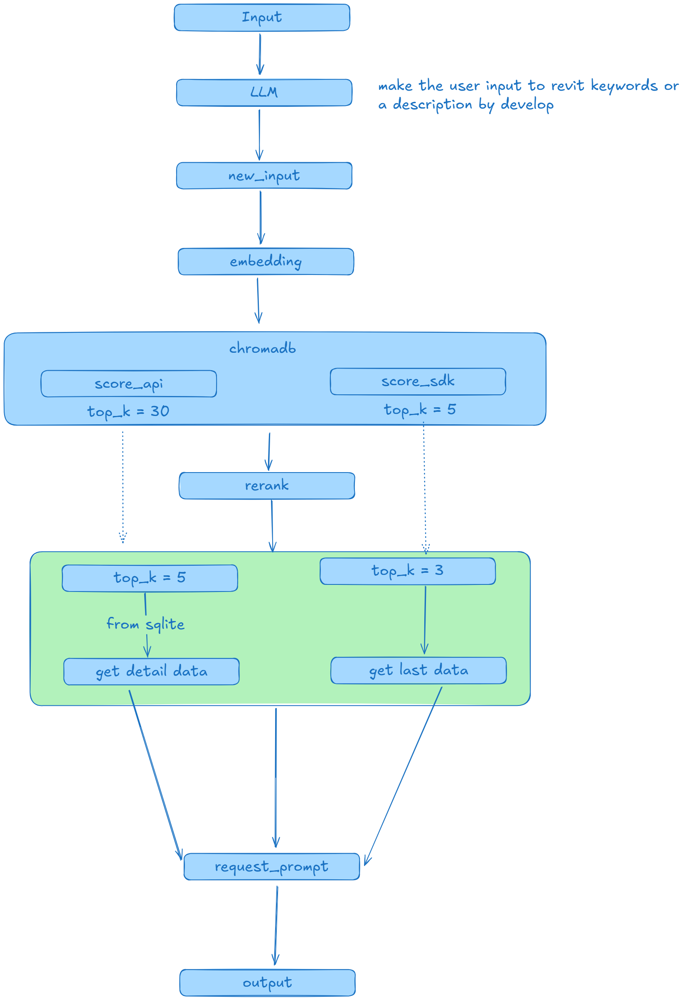
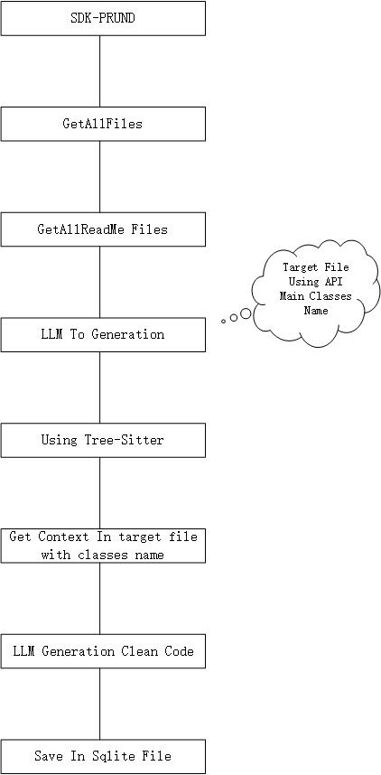

[English](./README.en.md) | **中文**

# 致谢与源代码归属 (Acknowledgements and Source Attribution)

本项目参考或直接使用了以下开源项目的代码和设计，在此致谢：

### 1. RevitSdkSamples — Jeremy Tammik

本 RAG 项目的训练数据（SDK 示例代码）来自 Jeremy Tammik 的 [RevitSdkSamples](https://github.com/jeremytammik/RevitSdkSamples) 项目。

- **License**: MIT License
- **用途**: 提取 C# 示例代码用于 RAG 检索和 Golden Code 生成
- 原始版权和授权详情，请参阅本项目根目录下的 `NOTICE` 和 `LICENSE` 文件

### 2. mcp-servers-for-revit — sparx-fire & mcp-servers-for-revit

本项目的 Revit 插件（`mcp_bridge` 模块）基于 [mcp-servers-for-revit](https://github.com/mcp-servers-for-revit/mcp-servers-for-revit) 项目的 Revit Plugin 和 CommandSet 组件。

- **License**: MIT License — Copyright (c) 2026 sparx-fire, mcp-servers-for-revit
- **用途**: 直接使用其编译的 Revit 插件 DLL（RevitMCPPlugin、RevitMCPCommandSet）作为 Revit 端的 TCP Socket 服务和命令执行器
- **参考内容**:
  - `plugin/Core/SocketService.cs` — TCP JSON-RPC 2.0 通信协议
  - `commandset/Commands/ExecuteDynamicCode/` — Roslyn 动态代码编译执行
  - `command.json` — 23 个预置命令定义
- **原始项目**: Fork of [revit-mcp](https://github.com/mcp-servers-for-revit/revit-mcp)

---

# Revit API RAG

基于 Revit API 文档和 SDK 示例代码的 RAG（检索增强生成）系统，帮助开发者快速生成 Revit C# 插件代码。

## 2025.03 重大更新

### 项目重构
- 旧版代码（AutoDL 本地训练）已迁移至 [`legacy/`](./legacy/) 目录保留 — **[查看旧版完整文档及逻辑图](./legacy/README.md)**
- 新版 Pipeline 迁移至 **Google Colab** 运行，利用免费 GPU + Google Drive 存储
- 项目结构重新组织，分离 `pipeline/`（训练）和 `server/`（部署）

### 架构概览

```
revit-api-rag/
├── pipeline/              # 数据处理 & 训练（Colab 运行）
│   ├── run_all.ipynb      # 主训练 Notebook
│   ├── api_parser/        # API 文档解析
│   │   ├── parse_chm.py   # CHM HTML → 结构化数据
│   │   └── quality_agent.py  # LLM 质量剪枝
│   ├── sdk_parser/        # SDK 代码解析
│   │   ├── extract.py     # .cs 源码提取
│   │   └── quality_agent.py  # Golden code 生成
│   ├── embedder/          # 向量化
│   │   └── embed.py       # SQLite → ChromaDB
│   ├── retriever.py       # 两层检索器
│   └── llm_client.py      # LLM 客户端（OpenRouter）
├── mcp_bridge/            # Revit 交互桥接层
│   ├── router.py          # FastAPI 路由（SSE 流式生成、健康检查等）
│   ├── code_generator.py  # RAG 上下文组装 + LLM 代码生成
│   ├── interactive.py     # LLM 意图分类 + Revit 数据查询
│   ├── revit_client.py    # TCP JSON-RPC 2.0 客户端
│   ├── client_pool.py     # 连接池（单例 + 自动重连）
│   ├── sandbox.py         # C# 代码安全审查
│   ├── tool_store.py      # Solidified Tool 持久化
│   └── frontend/          # Gradio Web UI
│       └── app.py         # 多步交互界面（Thinking + Pipeline + 代码执行）
├── intent_bridge/         # Intent Bridge Agent — 意图解析 + 参数收集
│   ├── slot_engine.py     # 核心引擎（动态 RAG + LLM Agent + 问答队列）
│   ├── router.py          # FastAPI 路由（会话管理、意图解析）
│   ├── llm_adapter.py     # LLM 适配器（primary/fallback + 重试）
│   ├── models.py          # Pydantic 数据模型
│   └── schemas/
│       └── intent_registry.yaml  # 轻量 intent 注册表（~65 行）
├── revit_plugin/          # Revit 2026 插件（C# / .NET 8）
│   ├── plugin/            # RevitMCPPlugin — TCP Socket 服务
│   └── commandset/        # RevitMCPCommandSet — 23 个预置命令
├── config/                # 配置
│   └── config.yaml
├── data/                  # 生成的数据库文件
│   ├── sqlite/            # SQLite（API + SDK 结构化数据）
│   └── legacy_db/         # 旧版数据库（保留参考）
├── server/                # Web 服务（部署用）
├── legacy/                # 旧版代码（AutoDL 时期）
└── docs/                  # 文档
```

## 数据处理 Pipeline

> V1 旧版 Pipeline 的详细逻辑图和 Prompt 设计请参考 [legacy/README.md](./legacy/README.md)

### API 文档处理



```
Revit 2026 API CHM
    ↓ 7z 解压
HTML 文件 (~27000+ 页)
    ↓ parse_chm.py 解析
结构化数据 (name, summary, syntax, parameters, remarks...)
    ↓ quality_agent.py (Gemini Flash 剪枝)
revit_api.db (SQLite)
    ↓ embed.py
ChromaDB 向量库 (API)
```

- **解析**: 从 CHM 解压的 HTML 中提取类名、方法签名、参数、备注等结构化信息
- **剪枝**: 使用 Gemini Flash 对低质量/冗余条目进行清洗，保留高质量 API 参考
- **存储**: SQLite 存储全量结构化数据，ChromaDB 存储 `name + summary` 的语义向量



### SDK 代码处理



```
Revit SDK Samples (~200+ 项目)
    ↓ extract.py (tree-sitter 解析)
.cs 源码 → 类/方法提取
    ↓ quality_agent.py (Gemini 生成 Golden Code)
SDK golden code (JSON)
    ↓ SQLite 存储
revit_api.db (sdk_code 表)
    ↓ embed.py
ChromaDB 向量库 (Code)
```

- **提取**: 使用 tree-sitter 解析 C# 源码，提取类定义、方法签名、关键代码块
- **Golden Code**: LLM 阅读项目 README + 源码，生成精炼的示例代码
- **存储**: SQLite 存储 golden code + 元数据，ChromaDB 存储代码语义向量

### Embedding 策略
- **API 向量化**: `name + summary` → OpenRouter Embedding API → ChromaDB
- **Code 向量化**: `golden_code summary` → OpenRouter Embedding API → ChromaDB
- **检索**: 查询 → ChromaDB 语义搜索 (top_k) → SQLite 回查全文内容
- **重排序**: 可选 rerank 模型对结果精排

## RAG 检索 & 代码生成



```
用户查询: "创建结构柱"
    ↓ Query Rewriting (LLM 提取 API 关键词)
改写: "structural column, NewFamilyInstance, FamilySymbol, Level"
    ↓ ChromaDB 语义搜索
API 结果: 15 条  |  SDK 结果: 5 条
    ↓ 上下文组装
Prompt = API Reference + SDK Code + User Query
    ↓ LLM 流式生成 (Gemini Flash / Claude)
输出: C# 插件代码（简洁模式 / 完整模式）
```



## Release 文件

### RAG 数据库 — [v2.0-data](https://github.com/imkcrevit/revit-api-rag/releases/tag/v2.0-data)

训练完成后产出 4 个数据库文件：

| 文件 | 大小 | 说明 |
|------|------|------|
| `revit_api.db` | 33 MB | API 结构化数据（name, summary, syntax, parameters, remarks...） |
| `revit_sdk.db` | 932 KB | SDK Golden Code + 元数据 |
| `chromadb_api.tar.gz` | 286 MB | API 语义向量库（27596 条 embedding） |
| `chromadb_code.tar.gz` | 1.8 MB | SDK 代码语义向量库（153 条 embedding） |

下载后放置到对应目录：
```
data/
├── sqlite/
│   ├── revit_api.db          # API 结构化数据
│   └── revit_sdk.db          # SDK golden code
├── chromadb_api/              # 解压 chromadb_api.tar.gz
└── chromadb_code/             # 解压 chromadb_code.tar.gz
```

### Revit 插件 — [v0.2](https://github.com/imkcrevit/revit-api-rag/releases/tag/v0.2)

| 文件 | 大小 | 说明 |
|------|------|------|
| `revit-mcp-plugin-v0.2-R2026.zip` | 20 MB | Revit 2026 插件（DLL + .addin + CommandSet） |

安装方法：
```
1. 下载 revit-mcp-plugin-v0.2-R2026.zip
2. 解压到 %APPDATA%\Autodesk\Revit\Addins\2026\
3. 重启 Revit 2026
```

解压后目录结构：
```
%APPDATA%\Autodesk\Revit\Addins\2026\
├── mcp-servers-for-revit.addin          # 插件注册清单
└── revit_mcp_plugin/                    # 插件主目录
    ├── RevitMCPPlugin.dll               # 主插件（TCP Socket 服务）
    ├── RevitMCPSDK.dll                  # MCP SDK
    ├── Newtonsoft.Json.dll              # JSON 序列化
    └── Commands/
        ├── commandRegistry.json         # 命令注册表
        └── RevitMCPCommandSet/          # 命令集
            ├── command.json             # 23 个预置命令定义
            └── 2026/                    # Revit 2026 编译产物
                ├── RevitMCPCommandSet.dll
                └── ...（依赖 DLL）
```

## 使用指南

详细的操作步骤和演示请参阅 **[使用指南 — Intent Bridge 交互操作](./docs/usage-guide.md)**，包括：

- **单步命令执行**（Direct）— 查询、修改、删除等直接生成代码并执行
- **多步交互：族类型选择**（Select Family）— 创建墙/柱/梁/楼板，先从 Revit 查询可用族类型供用户选择
- **多步交互：宿主选择 + 族类型**（Select Both）— 创建窗户/门，先在 Revit 中选择宿主墙体
- **Thinking 推理过程** — LLM 推理链实时流式展示
- **Pipeline 进度日志** — 9 阶段进度实时显示
- **Solidified Tools** — 工具固化与复用

## 环境要求

- **训练环境**: Google Colab (免费版即可)
- **Revit 版本**: 2026
- **LLM**: OpenRouter (Gemini Flash / Claude / GPT)
- **Embedding**: OpenRouter Embedding API
- **存储**: Google Drive (ChromaDB + SQLite ~100MB)

## 快速开始

### 训练（Colab）
1. 打开 `pipeline/run_all.ipynb` in Google Colab
2. 按顺序运行所有 Cell
3. 生成的数据库文件自动保存到 Google Drive

### 部署（本地/GCP）
```bash
# 安装依赖
pip install -r requirements-server.txt

# 启动服务
python -m server.main
```

---

## 更新日志

### 2026.03 — V0.3 Intent Bridge Agent 重构

**Intent Bridge 架构重构**
- 删除 974 行 `intent_slots.yaml` 硬编码 slot 定义，替换为 ~65 行 `intent_registry.yaml` 轻量注册表
- 每个 intent 只保留分类信息（display_name、keywords、mapped_commands），参数由 RAG + LLM 动态推理
- 新增 `custom` intent：未匹配已知 intent 时自动降级为 RAG 匹配，不再直接拒绝

**动态 RAG 搜索**
- 新增 `_extract_search_terms()` 动态搜索词提取，替代硬编码 `_INTENT_API_PATTERNS`
- 支持三种提取策略：registry 关键词匹配、中英文术语映射（~20 条）、正则提取技术术语
- 未知操作（如 "create a ramp"）也能通过 RAG 查找相关 API 文档

**Agent 风格 Prompt 重写**
- 移除所有 intent 特定的硬编码规则，改为通用 Agent 指令
- 强制 LLM 从 RAG API 文档推理参数，禁止静默默认坐标/类型/标高
- 数量检测：`quantity > 1` 时位置参数自动要求数组输入
- 明确的"禁止行为"列表防止 LLM 自作主张

**执行匹配层（Execution Matching）**
- structured_output 新增 `execution` 字段：包含 `strategy` 和 `mapped_commands`
- 每个 intent 关联 Solidified Tool 命令名，为后续 intent → Revit 命令自动翻译做准备
- 新增 `/execution-map` API 端点：返回全部 intent → command 映射关系

**文档**
- 新增 `intent_bridge/README.md`：架构图、模型配置表、API 端点列表、多人部署方案

### 2026.03 — V0.2 Intent Bridge + Revit 交互

**Gradio 多步交互 UI**
- 全新 4 步工作流界面：Input → Select Options → Review Code → Execute
- Thinking 模式：LLM 推理过程 `<thinking>` 实时流式显示，可折叠查看
- Pipeline 进度日志：Query Rewrite → Embedding → Vector Search → Hydrating → Combining → Assembling → LLM Generating → Extracting → Security Review，逐步显示带颜色标记
- 实时 JS 计时器，流式生成期间持续递增显示耗时
- 固定高度可滚动面板，避免页面跳动

**Intent Bridge — 多步 / 单步解析**
- LLM 意图分类器（`interactive.py`）：自动识别用户指令类型
  - **单步（Direct）**: 查询、修改、删除等操作直接生成代码
  - **多步（Select Family）**: 创建墙/柱/梁/楼板等需要族类型选择，先查询 Revit 可用族类型供用户选择，再生成代码
  - **多步（Select Both）**: 创建窗户/门等需要宿主选择 + 族类型选择，先触发 Revit 选择模式让用户点选宿主元素
- 支持从用户指令中提取坐标参数（2D/3D）
- 关键词回退机制：LLM 不可用时自动切换规则匹配

**Revit 实时交互**
- TCP JSON-RPC 2.0 协议连接 Revit 2026 插件（端口 18080）
- 丰富的连接状态显示：版本号、协议、端点、延迟、时间戳
- 查询族类型、标高、已选元素
- 触发 Revit PickObject 交互选择模式
- 动态代码执行 + 结果回显

**SSE 流式代码生成**
- `/generate-stream` 端点：SSE 协议逐 token 流式输出
- 9 阶段 Pipeline 进度事件 + token 事件 + 完成事件
- Thinking / Code 分离正则提取
- 安全审查：代码执行前自动扫描危险 API 调用

**Solidified Tools**
- 成功执行的代码可一键固化为可复用工具
- 工具参数通过 Revit 动态查询（族类型列表、标高列表等）
- API Explorer 面板查看和管理已固化工具

**Revit 插件 Release**
- 编译 Revit 2026 Release 版 DLL，打包上传至 [GitHub Release v0.2](https://github.com/imkcrevit/revit-api-rag/releases/tag/v0.2)
- 包含 RevitMCPPlugin + RevitMCPCommandSet（23 个预置命令）+ .addin 注册文件

### 2025.03 — V2 重大重构
- 旧版代码迁移至 [`legacy/`](./legacy/) — [查看旧版文档](./legacy/README.md)
- Pipeline 迁移至 Google Colab
- 新增 SDK Pipeline V2（tree-sitter + LLM golden code）
- 新增 Quality Agent（API + SDK 数据剪枝）
- 新增 Query Rewriting（查询改写）
- 新增流式代码生成（简洁模式 / 完整模式）

### 2025.10.23 — SDK Embedding ([详细文档](./legacy/README.md#2025-10-23-update))
- 使用 tree-sitter 提取 SDK 代码块
- LLM 生成 clean code JSON
- 数据存储至 SQLite

### 初始版本 — API RAG ([详细文档](./legacy/README.md#revit-api-rag-v1))
- Revit API CHM 解析 → SQLite + ChromaDB
- SDK 代码解析 → ChromaDB
- 基础 RAG 检索 + 代码生成
