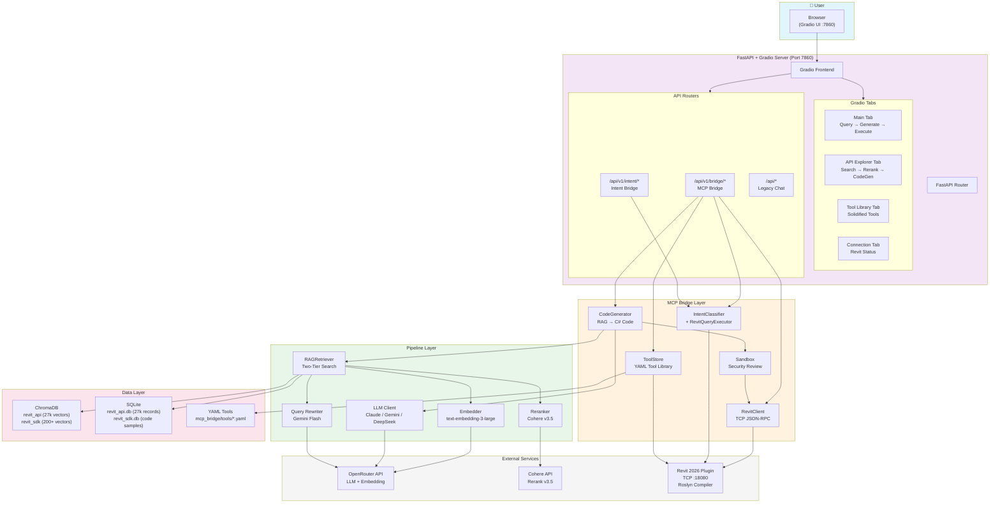
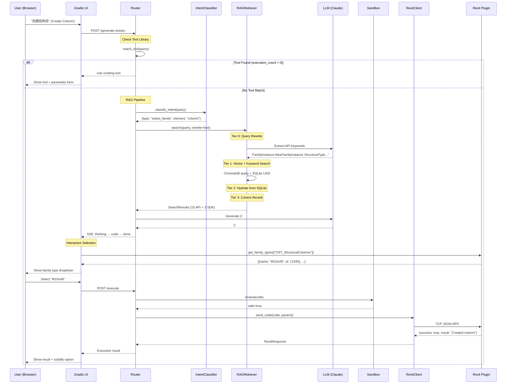
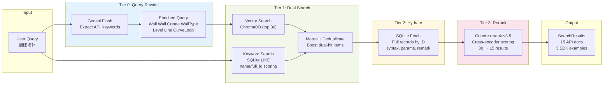

# Revit API RAG — System Architecture

## High-Level Architecture



## Data Flow: Query → Code → Execution



## RAG Retrieval Pipeline Detail



## Keyword Search Scoring Algorithm

```
Score Formula (per token):
  +5.0  token found in API name
  +3.0  bonus: token starts a name segment (e.g. "Wall" in "Wall.Create")
  +1.5  token found in full_id only
  +0.5  token found in summary

Penalties:
  ×0.3  name starts with "BuiltInFailures."
  ×0.6  name starts with "BuiltInParameter."
  ×0.3  name length > 80 chars
  ×0.5  name length > 60 chars
  ×0.7  name length > 40 chars
  ×0.5  name has 3+ dots (deeply nested)

Bonus:
  ×2.0  ALL search tokens found in name

Example: "create wall"
  Wall.Create Method         → (5+3 + 5+3) × 2.0 = 32.0  ✅ Top result
  WallFoundation.Create      → (5+3 + 5+3) × 2.0 = 32.0  ✅ Top result
  BuiltInFailures.Wall...    → (5+3 + 5+3) × 0.5 × 0.3 = 4.8  ⬇ Pushed down
```

## Component Directory Map

```
revit-api-rag/
├── server/                          # Web Server Layer
│   ├── main.py                      # Entry point: uvicorn + FastAPI + Gradio
│   ├── app/
│   │   ├── deps.py                  # Singletons: config, retriever, session
│   │   └── session.py               # Session store (2hr TTL)
│   ├── frontend/
│   │   └── gradio_app.py            # Gradio UI builder (4 tabs)
│   └── routers/
│       └── chat.py                  # Legacy /api/chat endpoint
│
├── pipeline/                        # Data & ML Pipeline
│   ├── retriever.py                 # RAGRetriever (vector + keyword + rerank)
│   ├── reranker.py                  # Cohere rerank wrapper
│   ├── llm_client.py                # OpenRouter LLM client (streaming)
│   ├── embedder/
│   │   ├── providers.py             # Embedding provider factory
│   │   └── embed.py                 # Batch embedding + ChromaDB storage
│   ├── api_parser/                  # Revit CHM → SQLite
│   │   ├── parse_chm.py            # HTML extraction from CHM
│   │   └── quality_agent.py        # LLM-based quality filtering
│   └── sdk_parser/                  # SDK source → Golden code
│       ├── extract.py              # tree-sitter C# parsing
│       └── quality_agent.py        # LLM golden code generation
│
├── mcp_bridge/                      # Code Generation & Execution
│   ├── router.py                    # /api/v1/bridge/* endpoints
│   ├── code_generator.py            # RAG context → C# code (23-rule prompt)
│   ├── revit_client.py              # TCP JSON-RPC to Revit plugin
│   ├── sandbox.py                   # Static security review
│   ├── interactive.py               # Intent classification + Revit queries
│   ├── tool_store.py                # Tool solidification (YAML)
│   ├── tools/                       # Saved tool YAML files
│   └── frontend/
│       ├── app.py                   # Main Gradio tab (query → execute)
│       └── api_explorer.py          # API Explorer tab
│
├── intent_bridge/                   # Intent Parsing (Module 2)
│   ├── router.py                    # /api/v1/intent/* endpoints
│   ├── llm_adapter.py              # LLM wrapper for intent parsing
│   ├── slot_engine.py              # Parameter slot management
│   └── orchestrator.py             # Multi-turn conversation state
│
├── revit_plugin/                    # C# Revit 2026 Plugin
│   ├── RevitMCPPlugin.cs           # TCP server (:18080)
│   ├── RevitMCPCommandSet.cs       # 23 predefined commands
│   └── RevitMCPPlugin.addin        # Revit addon manifest
│
├── config/
│   └── config.yaml                  # All configuration
│
└── data/
    ├── chromadb/                    # Vector embeddings
    │   ├── revit_api/              # 27k API doc vectors
    │   └── revit_sdk/              # 200+ SDK code vectors
    └── sqlite/
        ├── revit_api.db            # Full API documentation
        └── revit_sdk.db            # SDK golden code samples
```

## External Service Dependencies

| Service | Protocol | Purpose | Key Env Var |
|---------|----------|---------|-------------|
| OpenRouter | HTTPS | LLM (Claude/Gemini/DeepSeek) + Embedding | `OPENROUTER_API_KEY` |
| Cohere | HTTPS | Rerank v3.5 (optional) | `COHERE_API_KEY` |
| Revit Plugin | TCP :18080 | Code execution + element queries | N/A (localhost) |

## Tech Stack

| Layer | Technology |
|-------|------------|
| Frontend | Gradio 6.x (Python) |
| Backend | FastAPI + Uvicorn |
| LLM Gateway | OpenRouter (multi-provider) |
| Embedding | OpenAI text-embedding-3-large (3072d) |
| Vector DB | ChromaDB (persistent) |
| Content DB | SQLite |
| Reranking | Cohere rerank-v3.5 |
| Revit Plugin | C# / .NET 8 / Roslyn |
| Communication | TCP JSON-RPC 2.0 / SSE |
