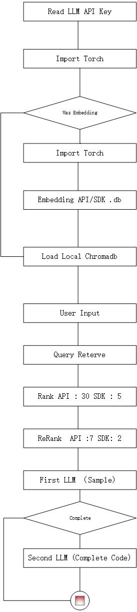

# Revit API RAG — V1 旧版文档

> 此文档为 V1 版本（AutoDL 本地训练时期）的原始 README，保留作为历史参考。
> 当前版本请查看 [主 README](../README.md)。

---

# 2025.10.23 Update
## SDK Embedding Setup
1. Add New File [Revit SDK Kernel](./revit_sdk_prund/sdk_prunding.ipynb)
2. Use `tree-sitter` to get the gold-code block , and remove the `using` , `namespace` or some `summary`
3. Use A LLM to read all gold-code block and generation a clean code
4. Use The LLM json output format
5. Save Data To [Sqlit File](./revit_sdk_collection/revit_sdk.db)


## Main Workflow
1. Embedding the sdk file , And Save To [chromadb1022_code_1](../data/legacy_db/chromadb1022_code_1.db/)
2. Add New Setup Will Generation A Simple Code If user Want To Complete Code , Can input the target-character to get
3. Remove The API Key Files
4. Update The Prompt To Main Workflow
5. The Result OutPut [output_text.md](./output_text_1023.md)



---

# revit-api-rag (V1)

this is a rag project to use revit api

## Tip

- This is a small rag project that can split revit api and make the database to rag
- token need to get file content which you save as

## Environment
`./requirements.txt`

## Revit Version
`2026`

## Graphics Platform
- `https://www.autodl.com/`
- graphics : 5090
- cuda : 12.8
- embedding & rerank model : QWen 0.6B
- embedding database : chromadb
- database : sqlite

## Split The RevitAPI File


### Setup
1. Get RevitAPI.chm and unzip it by 7-zip or other tools
2. Get The Data Folder -> `./html`
3. use `./split_revit.ipynb` to get the class data
    - class name
    - class info
    - class summary
    - class remark
    - parameters
    - exception
4. save data
    - `name - info` to embedding and save to `python_revit_train/chromadb0815_api_1.db`
    - other context to `python_revit_train/revit_api.db`

    

## Split The SDK Sample Code


### Setup
1. Look Up ALL Folder
2. Get `ReadMe.rtf` And all `.cs` files
3. use the `./extra_data/` to get all code
4. save the data to `./extra_data/project_dataset.json`
5. save to chromadb database . `python_revit_train/chromadb0818_code_1.db`

## Workflow in RAG


### Setup
1. the user input :  `query: 创建结构柱`
2. retrieve the user input using prompt setting `Keywords: structural columns, create, NewFamilyInstance, Level, XYZ, FamilySymbol`
    ```python
    f"""
    you are a professional bim engineer, you are good at Revit API...

    output format:
    Keywords: structural columns, coloring Override Element Graphics, View Filter,
              OverrideGraphicSettings, SetElementOverrides

    Remember:
    - Only provide the keywords in the output.
    - Ensure the keywords are relevant to the user's question.
    - The keywords should be concise and directly related to Revit API functionalities.
    """
    ```
3. embedding the retrieve query
4. get the top_k result from `chromadb0818_code_1.db` and `chromadb0815_api_1.db`
    - apis : 30
    - codes : 5
5. rerank by query get a half of result
    - apis : 15
    - codes : 3
6. use the answer prompt
    - **in this prompt, tell the LLM to think with four criteria, then output the answer — this makes the LLM re-check the response**
    ```python
    f"""
    you are a professional bim engineer, you are good at Revit API...

    you need to base on this four reference to answer the question:
    1. Completeness: entire process from start to submission
    2. Professionalism: correctly handle Revit element characteristics
    3. Robustness: error handling and boundary condition checking
    4. Scalability: easy to add more functions
    5. Best practice: follow Revit API development specifications

    this is the reference of Revit API:
    {api_reference + code_reference}

    Remember:
    1. Must Be True to the reference
    2. Do not generate code that is not in the reference and RevitAPI
    3. Know What User Want
    4. Give User A Complete Code Solution
    """
    ```
7. output result → Complete C# plugin code
